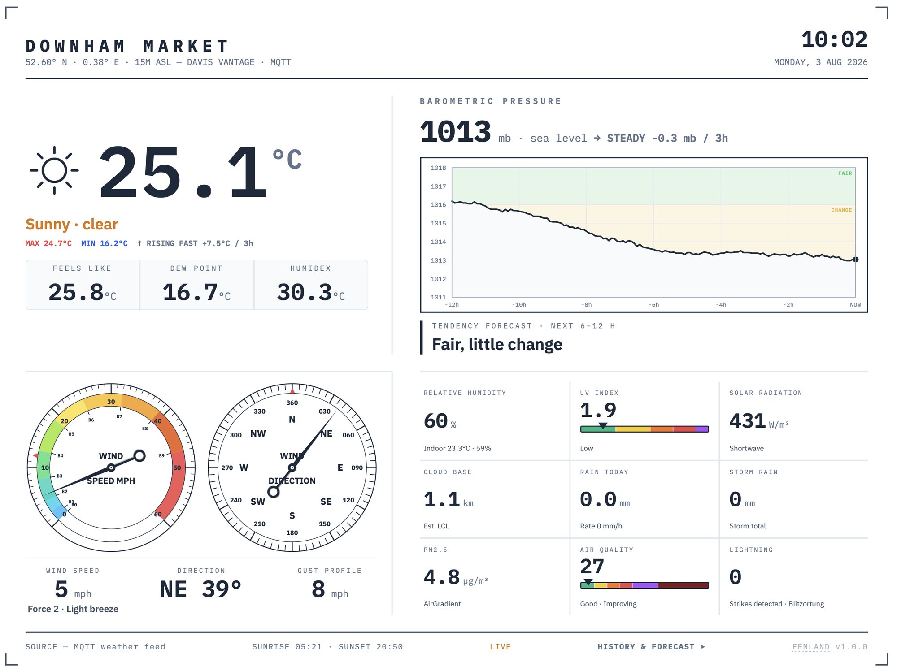
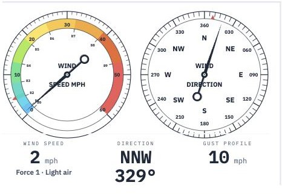
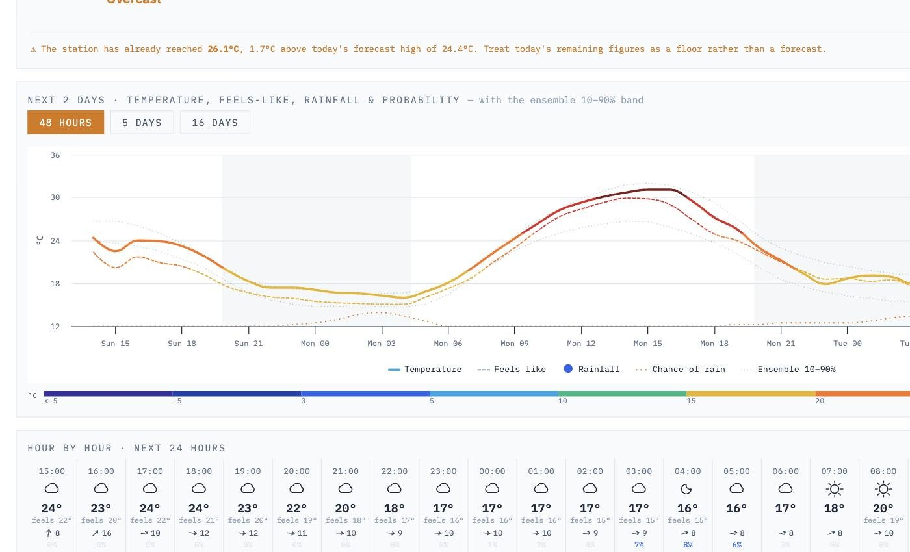
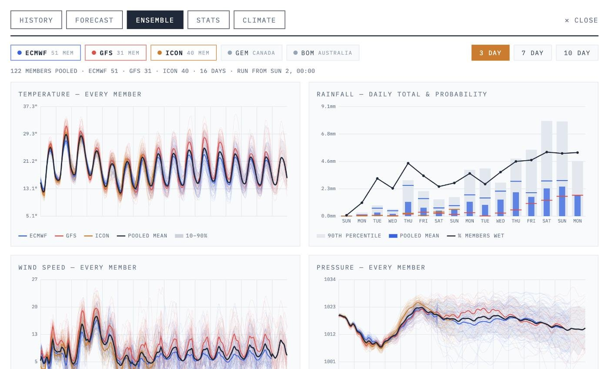
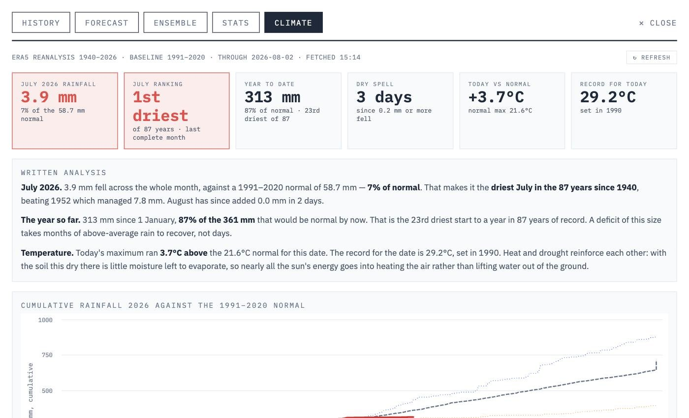

# Fenland

A weather skin for [weeWX](https://weewx.com) — live dashboard, multi-model
ensemble, 16-day forecast and 86 years of climatology.

**[Live demo](https://digitalurban.github.io/fenland/)** ·
[Install](#install) · [Configuration](#configuration) · [weeWX notes](weewx/README.md)



Fenland is a front end, not a data logger. weeWX does the hard work of talking
to your station; this shows it, and adds the forecast side that weeWX skins
usually leave out — where the models disagree, how confident to be, and how
unusual today is against the long record.

It works without a weather station too. Point it at any coordinates and the
forecast, ensemble and climate tabs work on their own.

---

## What's in it

### Live dashboard



Hand-drawn SVG instruments — wind speed with Beaufort banding, a compass with a
needle that takes the short way round, a rolling barograph with a tendency
forecast, and metric tiles for whatever else your station reports. Fed either
by MQTT for genuinely live updates, or by polling a JSON file if you don't run
a broker.

The layout is a single screen with no scrolling, scaled to your window: readable
on a 13″ laptop, comfortable on a 4K panel, and it falls back to a stacked
mobile layout on a phone.

<br clear="all">

### Forecast



Open-Meteo's best-match run, hourly to 16 days, with the temperature line
colour-banded by value. Fourteen day cards that expand to full detail, an hourly
strip, and a written summary in plain English.

Two things set it apart from a normal forecast display. It shows **where the
deterministic run sits inside the ensemble spread** — a forecast at the 90th
percentile of its own ensemble is telling you something. And if you have a
station, it flags when your gauge has already beaten the forecast maximum.

### Ensemble



120+ members from ECMWF, NOAA GEFS and DWD ICON pooled into one view, coloured
by forecast centre so an outlier model is obvious at a glance. Day-by-day
figures give the pooled mean, the 10–90% range and the full member envelope,
with **separate confidence ratings for temperature and rainfall**, because those
fail independently — you can know the temperature to within a degree and have no
idea whether it will rain.

The written analysis is generated from the live spread on every load.

### Climate



86 years of ERA5 reanalysis for your coordinates, so the page can say how
unusual today is rather than just what it is: *"the driest July in the 87 years
since 1940"*, *"no year since 1940 has been drier to this date"*. Cumulative
rainfall against the 1991–2020 normal with the driest and wettest years for
context, monthly anomalies, and ranked tables with the current year highlighted.

About a megabyte, fetched once and cached for 24 hours.

### History and stats

The weeWX charts you'd expect — temperature, wind, rain, barometer, air quality
— plus a wind rose computed in the browser from your own direction and speed
data, and solar radiation and UV if your station reports them.

Every series is colour-banded by value: temperature on a cold-to-hot scale, wind
on Beaufort colours, AQI on the standard bands.

---

## Install

You need somewhere to serve static files. That can be your existing web host,
or GitHub Pages for free.

```bash
git clone https://github.com/digitalurban/fenland.git
cd fenland
cp config.example.js config.js
```

Edit `config.js` — at minimum `place`, `lat`, `lon` and `timezone`. Then serve
the folder:

```bash
python3 -m http.server 8000     # then visit localhost:8000
```

**Opening `index.html` directly won't work.** Browsers block outbound requests
from `file://` pages, so nothing can reach the APIs. It has to be served over
http, even locally.

Without a `station` block you get the forecast, ensemble and climate tabs
working from Open-Meteo alone. Add one and the dashboard, history and stats come
alive. See [weewx/README.md](weewx/README.md) for what weeWX needs to publish.

### Hosting on GitHub Pages

Push the repo, then Settings → Pages → Deploy from a branch → `main` → `/ (root)`.

One catch worth knowing before you spend an evening on it: **your JSON files
must send a CORS header**, because the page is now on a different origin from
your data. On Apache, add this to `.htaccess` in your web root — at the very
top, outside any `# BEGIN WordPress` block, since those get rewritten:

```apache
<IfModule mod_headers.c>
  <FilesMatch "\.json$">
    Header set Access-Control-Allow-Origin "*"
  </FilesMatch>
</IfModule>
```

Check it worked:

```bash
curl -sI -H "Origin: https://yourname.github.io" \
  https://yoursite.example/weewx.json | grep -i access-control
```

Keep the JSON on your own host rather than in the repo. Pages throttles frequent
rebuilds, and weather data changing every five minutes will hit that limit.

---

## Configuration

Everything is in `config.js`; `config.example.js` is the annotated reference.

| Key | Required | Notes |
|---|---|---|
| `place` | yes | Shown in the header |
| `lat`, `lon` | yes | Decimal degrees, negative for S/W |
| `timezone` | yes | IANA name, e.g. `Europe/London` |
| `elevation`, `hardware` | no | Cosmetic, shown under the title |
| `units.temp` | no | `c` or `f`. Default `c` |
| `units.rain` | no | `mm` or `in`. Default `mm` |
| `units.pressure` | no | `mb` or `inhg`. Default `mb` |
| `units.wind` | no | `mph`, `kmh`, `ms`, `kn`. Default `mph` |
| `mqtt` | no | Broker URL and topics — see below |
| `pollSeconds` | no | JSON polling interval. Default 20 |
| `station.*` | no | URLs of your weeWX JSON files |
| `ensembleModels` | no | Which ensembles to pool |
| `climate.baselineFrom/To` | no | Default 1991–2020, the WMO normal |

Everything is computed internally in metric and converted only for display, so
thresholds, rankings and confidence ratings stay consistent whichever units you
pick. Temperature differences (bias, anomaly, spread) convert correctly as
differences rather than as temperatures — a −1.5 °C bias reads as −2.7 °F, not
29.3 °F.

### Live data

Two ways, and you can set both:

**MQTT** gives genuinely live updates. Your broker needs to allow anonymous
subscribe over `wss://` — no credentials are used, and none should be, since
anything in `config.js` is public.

**JSON polling** needs no broker at all: weeWX writes the loop packet to a file,
the page fetches it on a timer. Slower, but far easier to set up.

With both configured, MQTT is used and polling waits in reserve — if the broker
goes unreachable for 90 seconds, the page falls back rather than sitting dead.

---

## Forecast verification

Optional, and the most interesting part if you have a station.

`scripts/verify.py` runs nightly, records what five different models forecast
and what your station actually measured, and scores one against the other by
lead time. After a few weeks it can tell you **which model is genuinely best for
your site** — not in general, but for your field, your valley, your patch of
coast. It scores Open-Meteo's blend, UK Met Office, ECMWF, DWD ICON and NOAA GFS
side by side.

Setup in [docs/verification.md](docs/verification.md).

---

## Data sources

- **[Open-Meteo](https://open-meteo.com)** — forecast, ensemble and ERA5 archive
  APIs. Free, no key, no registration. Data is CC BY 4.0 and the pages carry the
  attribution.
- **ERA5** reanalysis (ECMWF / Copernicus) via the Open-Meteo archive.

Please don't hammer the API. Nothing loads until a tab is opened and the
climatology caches for 24 hours; if you deploy somewhere busy, consider
Open-Meteo's paid tier.

---

## Licence

MIT — see [LICENSE](LICENSE).

**Highcharts** renders the charts and is *not* covered by that licence. It is
free for personal and non-commercial use; commercial use needs a licence from
Highsoft. Chart calls are isolated, so swapping in ECharts or uPlot (both MIT)
is a contained job if that matters to you.

No other dependencies. No build step, no npm, no framework.

---

## Credits

Built on top of [weeWX](https://weewx.com) and the JSON output of the
[Belchertown skin](https://github.com/poblabs/weewx-belchertown), which remains
the best place to start if you want a complete weather site rather than this
one's particular obsessions.
