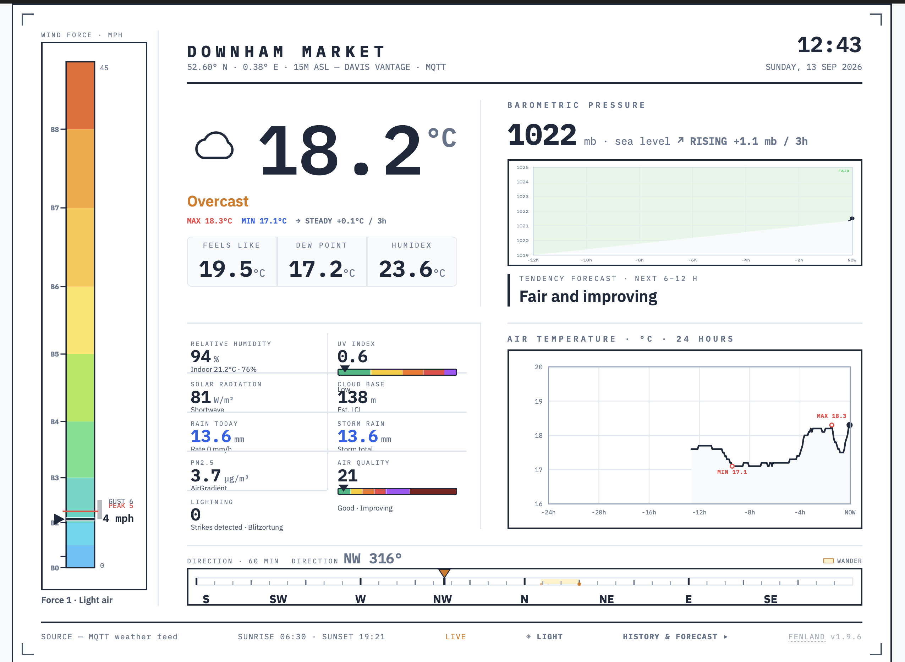

# Fenland v2 — wind panel and layout



The desktop dashboard can draw its wind data two ways, chosen in
`config.js`. The default, **bars**, is the layout above: a full-height
Beaufort tower down the left edge of the frame and a direction tape that
turns the corner at its foot and runs across the page. The alternative,
**dials**, is v1 unchanged — the round speed dial and compass rose in their
own cell.

Phones stack the same two graphics either way. There is no room for a
full-height tower on a handset, so the mobile layout, which `dashboard.js`
generates, is untouched by the setting.

## Choosing the layout

In `config.js`:

```js
windPanel: "bars",   // or "dials"
```

The decision has to be made before the first paint, or the dial layout
renders and is immediately thrown away. So an inline script in the document
head reads the setting and writes the `css/windtrace.css` link only for
`"bars"`; `windtrace.js` and `tempchart.js` both return early for
`"dials"`. Nothing of the bar skin loads or runs in that case, and
`css/dashboard.css` still holds the v1 grid as its base.

One consequence: `"dials"` is the whole v1 layout, so the tile panel returns
to three across in the right column and the air temperature trace disappears
with it — the v1 grid has no slot for it.

## What the bar layout changes

Against v1, on desktop only:

- **Beaufort tower** — the dial's own colour bands (thresholds and hex values
  from `buildDialVectors`) stood on end, because the cell has height to spare
  and a horizontal strip only ever used its width. A sprung needle carries the
  current speed with the reading beside it, and a red line marks the hour's
  peak. The scale runs to 45 mph and stretches if the hour goes past it.
  Beaufort ticks are labelled B0–B9, a label dropped where two would collide.
  The Force description sits under the tower's header.
- **Direction tape** — the rose unrolled on a FIXED S·W·N·E·S scale, so the
  pointer travels rather than the scale sliding under a static marker. The
  shaded band is the hour's wander, the dotted trail the hour's track, and
  the bearing reads in the tape's own header. It spans the width of the frame
  between the tiles and the footer, which is what frees the left edge for the
  tower.
- **Wind readout box** — gone. Speed reads off the needle, the hour's peak
  off the red line, the bearing off the tape header, Force off the tower.
  The bearing and Force nodes are MOVED, not copied, so `dashboard.js` keeps
  updating the same elements by id.
- **Tiles** — eight cells, moved out of the right column into the space the
  hero and the old readout box were sharing, two across and four down. The
  rule down their right edge continues the hero's, so the page still reads as
  two columns.
- **Air temperature** — a 24-hour trace under the barograph, in the
  barograph's own language: faint gridlines, wash fill, ink line, a dot at
  NOW, MAX and MIN marked on the trace and a dashed FREEZING line when zero
  is in view.
- **Barograph span** — 24 hours, matching the trace directly beneath it. It
  was 12. If `pressure-history.json` holds less than a day the trace fills
  from the right and grows leftward as the log extends.

## How it works

`windtrace.js` waits for the page, then fills `#windSpine` and
`#windTapeFull` and hides the old dial faces with `display: none`. The dial
nodes stay in the document deliberately: `dashboard.js` rebuilds the entire
mobile layout whenever `#speedSvg_mob` is missing and re-points the needles
by id on every update, so removing them starts a fight the script cannot win.

Each graphic measures the box it has been given and builds a viewBox of
exactly that shape, so it is never stretched and never overflows — which is
what the old faces did: they were sized from the row WIDTH by aspect-ratio,
ran taller than the wind cell allowed, and painted over the readout row.

Readings are taken from the cells `dashboard.js` has already written —
`#windSpeed`, `#windGust`, `#windDir_text` — once a second. That keeps unit
conversion, the `windScale` correction and the MQTT wiring in exactly one
place: no change to `dashboard.js`, and nothing new subscribed.

Samples are kept in `localStorage` under `fenland-windtrace-v1`, 60 of them,
discarded after two hours, so a reload does not start from an empty chart.
On a cold start the trace says `COLLECTING — n OF 60 MINUTES` and fills in.

Needle, peak tick and tape pointer are sprung with `dashboard.js`'s own
needle constants (0.65 / 1.29), so the panel settles like the dials did.

The tape pointer springs in the tape's own coordinates, not in raw degrees.
NE to NW is ninety degrees across north — a short hop on the strip — but as
raw numbers it is 45 to 315, and interpolating that drags the pointer the
long way through south and back. Converting first, then picking whichever
360-equivalent of the target lies nearest the pointer's current position,
always gives the shortest visible path. Only one move cannot be animated:
crossing the seam at due south, where the strip actually ends, and there the
pointer jumps from one edge to the other.

`tempchart.js` reads `<jsonBase>day.json`, series `chart1.series.outTemp` —
the same file the HISTORY & FORECAST charts already read — so nothing new is
published and `dashboard.js` is untouched. It refreshes every five minutes.

Colours throughout are the theme variables (`--ink`, `--accent`,
`--accent-light`, `--max-marker`), so dark mode follows without further
work, and both charts honour the °C/°F toggle through `window.U`.

## Files

New:

    src/windtrace.js     Beaufort tower + direction tape
    src/tempchart.js     24-hour air temperature trace
    css/windtrace.css    the bar layout, loaded only for windPanel: "bars"

Changed from v1:

    index.html           conditional stylesheet link, two script tags,
                         three new sections
    panes/dashboard.html the same three sections
    build.py             the same, in the HEAD and FOOT templates
    css/dashboard.css    hides the three new sections by default; the
                         barograph's min-height lowered 280 → 210
    src/dashboard.js     barograph window 12 h → 24 h (three constants)
    config.js            windPanel

Deploying the whole `v2/` folder needs no further work. Merging by hand,
work down the "Changed from v1" list; load order matters, with
`windtrace.css` after `dashboard.css` and `windtrace.js` after
`dashboard.js`.

## Known gaps

- The red 10-minute gust-direction tick from the mock is not wired: that
  value (`windGustDir10`) lives inside `dashboard.js` and is not published to
  the DOM. One line there — `window.__FENLAND_GUSTDIR__ = windGustDir10;` —
  would let the tape draw it.
- RAIN TODAY and STORM RAIN usually read the same figure, which makes one of
  the eight tiles redundant. Changing either needs `dashboard.js`, so both
  are left alone here.
- Animation needs a visible tab: browsers park `requestAnimationFrame` on
  hidden pages, exactly as they already do for the dial needles.
- The screenshot above predates the last round of fixes (the gust bar has
  since gone from the tower, the tile panel is less crowded and the tape
  header no longer says DIRECTION twice). Replace it at the same path with a
  fresh capture when convenient.
